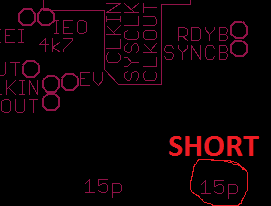
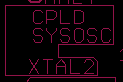
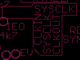
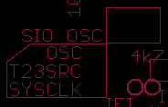

# mintz80_main_pcb
Main PCB for MintZ80

# PCBWay
Big THANKS to PCBWay for sponsoring this project by building Rev5 board for me! I've been using PCBWay services for years for my PCB manufacturing needs. Their PCBs were always manufactured to the highest standards. I was very happy when they proposed collaborating on this project and manufacturing this PCB for me. And they did not disappoint! This board has some tricky routing with high tolerance, thin traces both on <a href='img/Rev5_top.jpg' alt='PCB Top'>top</a> and <a href='img/Rev5_btm.jpg' alt='PCB Bottom'>bottom</a> of the board. The product I received was of highest quality with precise traces and crisp silkscreen. Also, the whole ordering process was smooth and quick. Uploading files was easy and I had a completed product in my hands in just a few days. Thank you PCBWay! I recommend thair service to everyone! PCB for this design can be purchased from PCBWay [here](https://www.pcbway.com/project/shareproject/MintZ80_r5_ffefebef.html). This board can be used standalone or with its [daughterboard](https://github.com/arturs-lab/mintz80_cf_pcb) which provides CF Card slot, YMZ384 sound chip, configuration switch and some other convenience features. [Here's](img/Rev5_assem_a17.jpg) an example of finished board with 628512 SRAM chip for 256K of available RAM.

# Software
Currently, a [monitor](https://github.com/arturs-lab/mintz80_monitor), [Very Tiny Language](https://github.com/arturs-lab/vtl) and [Altair 9K Basic](https://github.com/arturs-lab/mintz80_basic8k) are available for this board. Eventually CP/M will also be available.

# Configuration
CPU clock can be drivven from several sources depending on jumper configuration
* from CPLD clock divider. CPLD has configurable 4 rate clock divider with division rate programmed by two lowest bits of port $D0. To use 256K of RAM with Rev5 and above board, clock divider read circuit had to be removed from CPLD to acommodate circuit for managing A17/RAMEN2. Two lowest bits of port $D0 are used to select CPU clock divider but state of it can not be read back if CPLD is configured to manage more than 128K of RAM.
* externally by supplying clock on SYSCLK pin. In this case short out the pads of capacitor connected to XTAL1 to prevent unwanted oscillations.
. To drive CPLD clock, oscillator must be used or jumpers configured to connect SYSCLK to CPLD clock in. In PCB revisions prior to Rev5, this means that CPLD pin 2 connected to SYSCLLK signal must be reconfigured as input to prevent signal clash. In Rev5 and up, SYSCLK trace between CPU and CPLD is reversible via jumpers.
* from crystal oscillator of 2x required frequency connected to the CPU. This means that to run CPU at 10MHz, a 20MHz oscillator needs to be installed. In this case both 15p capacitors need to be populated. In this configuration, comments about supplying clock to CPLD and reversing pin 2 as above also apply.

Clock divider configuration:
* Install CPLD oscillator value 2x (or 4x) desired CPU clock 
* Connect CPLD CLK jumper to OSC 
* In Rev5 and above connect SYSOSC jumper to FROM CPLD 
* Connect SYSOSC to CPLD (SYSCLK to CPLD prior to Rev5) 
* Connect SYSCLK to CLKIN 

# RAM configuration
Prior to Rev5, the board only allowed 628128 128Kx8 Static RAM chips to be used. Beginning with Rev5, two more options are available. Each configuration requires different CPLD firmware to support it.
* 128Kx8 RAM chip like 628128 - jumper VCC/A17 pads from center to VCC to supply VCC to pin 30/CS2. Use CPLD code from prior versions with support for reading clock division value and controlling EXTIO signal.
* 128Kx8 two skinny RAM chips for total of 256K RAM - jumper VCC/A17 pads from center to VCC to supply VCC to pin 30/CS2. Use CPLD code supporting two RAM Enable connections - RAMEN and RAMEN2 on pin 33 of CPLD, which was used as EXTIO signal in prior versions. Bit 2 of memmap registers selects which chip will be activated for each bank.
* 512Kx8 chip like 628512 - only half of this chip is usable for total of 256K RAM due to lack of available CPLD pins and capacity to handle A18. Solder VCC/A17 pads from center to A17 to supply A17 to pin 30. Solder jumper on PLUP pads to pull A18 of 628512 high to only use half of it. Use CPLD code supporting A17 signal on pin 33 of CPLD. Bit 2 of memmap registers selects value of A17 for each bank.
Pin 33 of CPLD was used as spare EXTIO external IO enable signal od boards prior to Rev5. Starting with Rex5 it is used for additional signals A17 or RAMEN2 to allow 256K of RAM instead of prior 128K.

# Timers
T0SRC was mistakenly labeled T23SRC in Rev5 and TRG1 in Rev2.

SIO A and B baud rate is determined by clock dividers CTC3 and CTC2 correspondingly. CTC channels 2 and 3 can be drivven from:
* their own crystal - mount SIO OSC and leave T0SRC disconnected 
* SYSCLK signal - do not populate SIO OSC! Connect all three pads of T0SRC together. This will connect TRG3 and TRG2 to SYSCLK but also will force TRG0 to be drivven from SYSCLK 
* use a jumper wire to bypass center pad of T0SRC and connect two outer pads. Do not populate SIO OSC! This will feed TRG3 and TRG2 from SYSCLK while leaving TRG0 not connected here.

TRG0:
* Can be fed frequency from SIO OSC or from SYSCLK using T0SRC(T23SRC/TRG1) jumper pads.
* If jumpered to TRG1  - from the same source as TRG1. A jumper for this was added in Rev6. Prior to this a wire jumper can be added between pins TRG0 and TRG1 or between T23SRC/TRG1 pad and TRG1 connector pin, whichever is easier.
* Lastly, center pad of T0SRC(T23SRC/TRG1) can be wire-jumpered anywhere else on the board as convenient.

In Rev5 PCB, TRG1 only has a jumper to connect it to TC0 output or to TRG1 pin on main connector.This is sufficient for many uses:
* Daisy-chain TRG1 to TC0 to use as clock - use TC0 to output a pulse on TC0 on every millisecond. TC0 will also generate an interrupt at the same cadence to provide millisecond timer. Configure TC1 to generate interrupt for every 10 or 100 pulses received from TC0 and in ISR implement routine to have a clock with 10 or 100ms resolution.
* Drive TRG1 from some circuit on daughter board, e.g. CF card through pin TRG1 and have this trigger an ISR to handle event.

More flexibility is allowed by adding a jumper to drive TRG1 input from the same clock as TRG0. Option to do so was aded to Rev6 board. In Rev5 PCB this is easily done by installing a jumper between pins TRG1 and TRG0 as mentioned above.

# Memory layout
Entire 64KB address space is divided into 8 x 8KB pages. IO ports $D8-$DF (memmap) hold 3(2 prior to Rev5) bits each which control mapping of this page to EEPROM or RAM page in following fashion:
<pre>
addr range  default IO maps
$0000-$1fff  ROM0 	d8 00->rom0, 01->ram0, 02->rom2, 03->ram8, 04->rom0, 05->ram10, 06->rom2, 07->ram18
$2000-$3fff  RAM1 	d9 00->rom1, 01->ram1, 02->rom3, 03->ram9, 04->rom1, 05->ram11, 06->rom3, 07->ram19
$4000-$5fff  RAM2 	da 00->rom0, 01->ram2, 02->rom2, 03->rama, 04->rom0, 05->ram12, 06->rom2, 07->ram1a
$6000-$7fff  RAM3 	db 00->rom1, 01->ram3, 02->rom3, 03->ramb, 04->rom1, 05->ram13, 06->rom3, 07->ram1b
$8000-$9fff  RAM4 	dc 00->rom0, 01->ram4, 02->rom2, 03->ramc, 04->rom0, 05->ram14, 06->rom2, 07->ram1c
$a000-$bfff  RAM5 	dd 00->rom1, 01->ram5, 02->rom3, 03->ramd, 04->rom1, 05->ram15, 06->rom3, 07->ram1d
$c000-$dfff  RAM6 	de 00->rom0, 01->ram6, 02->rom2, 03->rame, 04->rom0, 05->ram16, 06->rom2, 07->ram1e
$e000-$ffff  RAM7   df 00->rom1, 01->ram7, 02->rom3, 03->ramf, 04->rom1, 05->ram17, 06->rom3, 07->ram1f
</pre>
rom0-rom3 refer to 8K chunks of 28C256 32K EEPROM
ram0-ram1f refer to 8k chunks of either 628128 or 628512 RAM chips
In board versions prior to R5, only ram0-ramf are valid. Code trying to use ram1x will end up writing to corresponding ramx

# Startup
```Hellorld```
Greetings, [Usagi Electric](https://www.youtube.com/watch?v=gQ6mwbTGXGQ)!

<pre>CPLD config:
10787878787878781011111111111111</pre>
IO adresses $d8-$df showing configuration of CLK divider, memory map and in other implementations - other register values which did not fit in this small CPLD.

```System clock 9.216MHz```
Just what it says, as configured in CONSTANTS.asm

```Checksum: 0A023D```
Monitor checksum calculated on the fly to help determine which monitor version we're running and make sure it is not corrupted.

<pre>CF Card Initialized
CF MBR executable found at C002
Found label: Monitor Loader A000</pre>
Label of bootloader found on CF card to help determine if that's what we want to run

<pre>Run it? (y/n/q)
CF Loading SYS sectors
CF SYSLD success
Found label: z80monitor_a000_SIO_0BDD82
Checksum: 0BDD82</pre>
Details about data found on sector 1 through 8.

<pre>Execute? (y/n)
Hellorld
CPLD config:
10787878787878781011111111111111
System clock 9.216MHz

Checksum: 0A023D

CF Card Initialized
CF MBR executable found at C002
Found label: Monitor Loader A000
Run it? (y/n/q)


MintZ80 Computer                        2015 MCook
 adaptation to MPF-1 / Z80 DART 2022 F.J.Kraan
Adaptation to MintZ80 2025 Artur's Lab
Monitor v1.3, ROM: A000h, RAM: 2000h, CTC: 10h, SIO: 18h, PIO: 1Ch</pre>
Last line reminds us what is where. In this case we chose to load and run test monitor running from address $A000 which is used to debug the actual main monitor.

# Releases
* [Rev 1](REV1.md)
* [Rev 2](REV2.md)
* [Rev 3](REV3.md)
* [Rev 4](REV4.md)
* [Rev 5](REV5.md)


