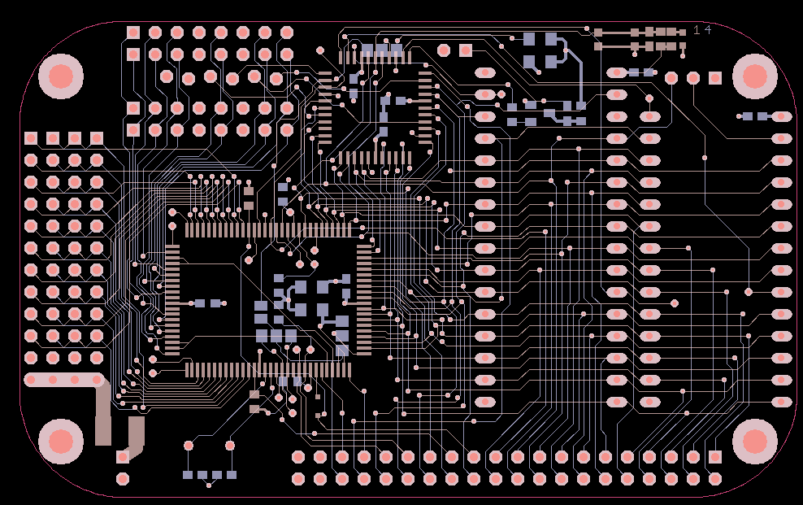
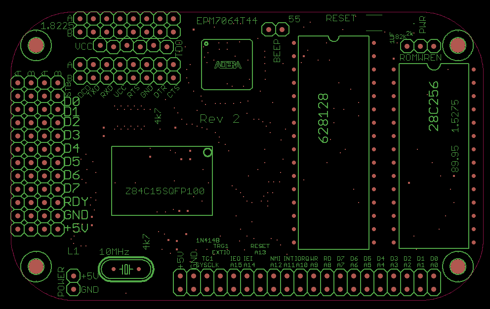
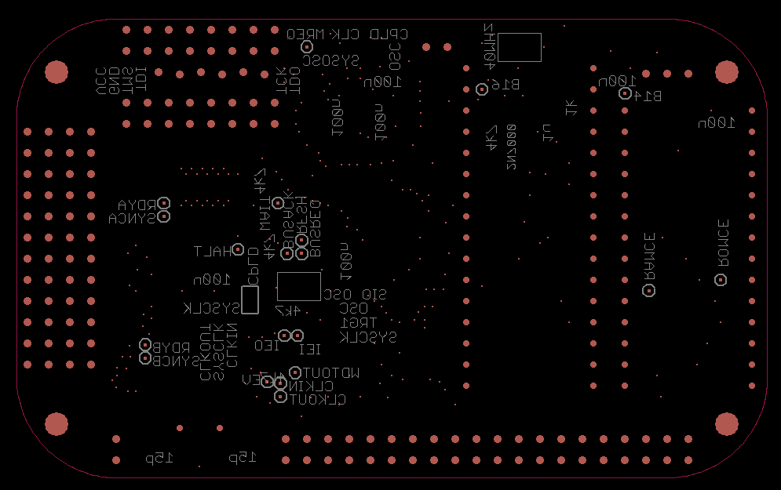

# Rev 2
Improved version with option to mount connectors close to the edge if that happens to be convenient for some build.
Default mounting position is inward to allow clearance for inserting board into Altoids tin.
Also more solder jumpers to allow various optons and some more pullup resistors that were missed in original design.

