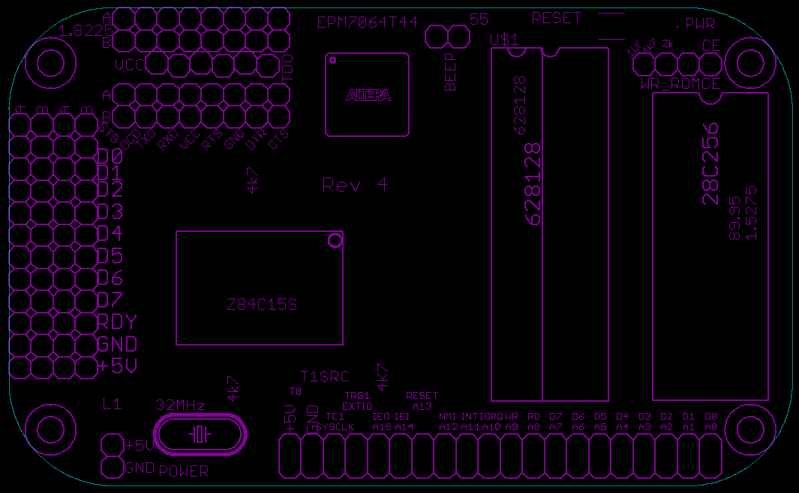
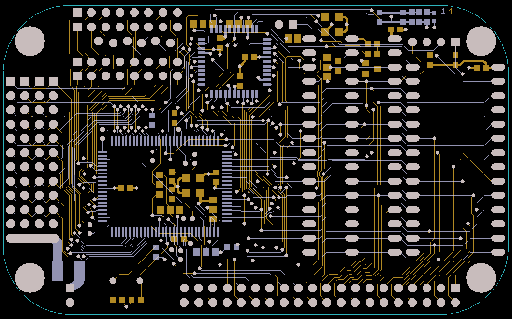

# Rev 4
This board adds option of using 0.3in wide "skinny" SRAM. These chips were used as cache RAM in old computers and were very fast.
It also adds 17th address line to allow up to 256K of RAM if 512KB SRAM chip is used like 628512. To use such chip, pin 1 which is 
A18 has to be tied to GND or +5V. The latter is accompplished by soldering "pullup" jumper near pin 1.
Unfortunately, implementing 18th address line to allow full 512K RAM was not possible due to resource limits of CPLD.

